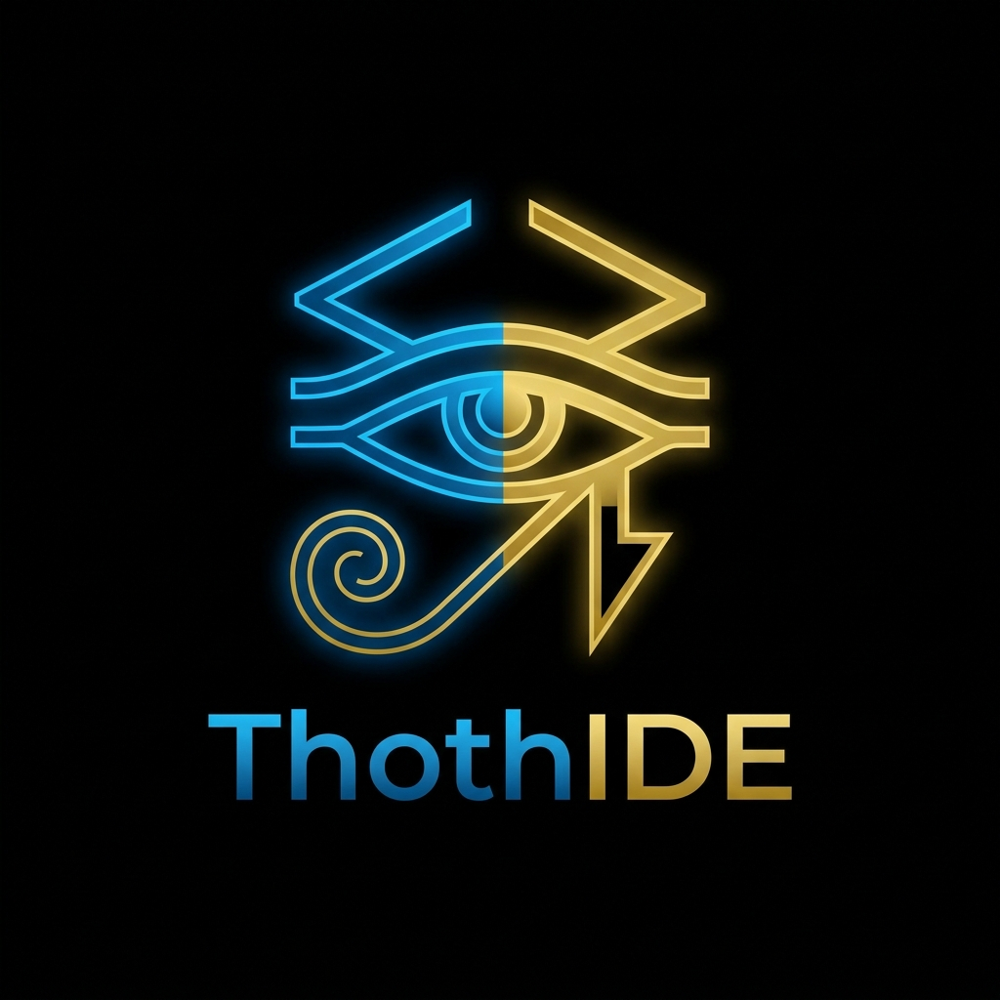

<div align="center">
  
  
  # ThothIDE
  
  **An Advanced, AI-Powered Python Desktop Environment**<br>
  *Engineered and Developed by **Eng. Ali Khalid***

  [](#)
  [](#)
  [](#)
  [](#)

</div>

---

## 🌌 Overview

**ThothIDE** is a next-generation Integrated Development Environment (IDE) built strictly for the AI era. It fundamentally shifts the paradigm from "coding assistance" to **"autonomous agentic workflows."** 

Unlike traditional editors, ThothIDE does not just autocomplete code; it features a non-blocking, multi-threaded AI agent that runs natively on your desktop. It communicates directly with your operating system via the **Model Context Protocol (MCP)**, allowing it to navigate files, read git diffs, and execute terminal commands to solve complex architectural problems.

---

## ⚡ Core Architecture

ThothIDE is built entirely in Python, utilizing a robust tech stack optimized for performance and AI capabilities:

1. **PyQt6 Framework:** The entire interface is rendered using C++ bindings via PyQt6. This guarantees a native, silky-smooth user experience across all operating systems, featuring a split-pane "Dark+" code editor.
2. **QThread Agentic Workers:** Heavy LLM inference and system operations are completely decoupled from the main UI thread. Your IDE will never freeze while the agent is "thinking" or running shell commands.
3. **FastMCP Integration:** Standardized tool-calling. The AI uses `FastMCP` servers to securely request local file reads, writes, and OS telemetry.
4. **Hugging Face OpenAI-Compatibility:** Plugs directly into any OpenAI-compatible endpoint hosting open-weight models (Llama 3, Qwen, Mistral).

---

## 🛡️ Security & Privacy (BYOK)

ThothIDE is designed for enterprise-grade privacy. 
- **Zero Telemetry:** The application makes zero external API calls outside of your explicitly provided Hugging Face endpoints.
- **Bring Your Own Key (BYOK):** API Keys are **never** hardcoded into the source or the compiled binaries. Upon first launch, the IDE securely prompts the user and encrypts the key at the root OS level (`~/.thothide/.env`), ensuring complete project safety.

---

## 🚀 Building from Source

ThothIDE features a completely automated build pipeline capable of packaging native desktop applications (`.app`, `.exe`, Linux Binaries).

### Local Build (macOS/Windows/Linux)
Ensure you are in a clean virtual environment to prevent dependency bloat:
```bash
python -m venv .venv
source .venv/bin/activate
pip install -r requirements.txt
python build.py
```
*The compiled application will be output directly to the `/dist` directory.*

### Cloud Build (GitHub Actions)
A `.github/workflows/build.yml` pipeline is pre-configured. Every push to the `main` branch automatically triggers Microsoft Cloud Servers to compile and attach cross-platform binaries to the workflow artifacts.

---

## ⚖️ Legal & Licensing

**PROPRIETARY AND CONFIDENTIAL**

Copyright &copy; 2026 **Eng. Ali Khalid**. All Rights Reserved.

This software and its underlying architecture are the proprietary and confidential property of Eng. Ali Khalid. You may not use, copy, modify, merge, publish, distribute, sublicense, and/or sell copies of the Software without express written permission from the author. 

See the `LICENSE` file for strict limitations and conditions.
